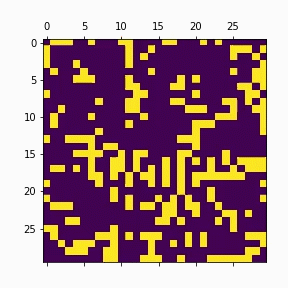

# GameOfLife
Famous cell "simulation" called "Game of Life" implemented with threads and processes. 
 
This project was made by the help of my colleague Mateja Vasic and myself, Mihajlo Madzarevic. 
 
To run this project take "GameOfLife.ipynb" and open it in Google colab. 
 

